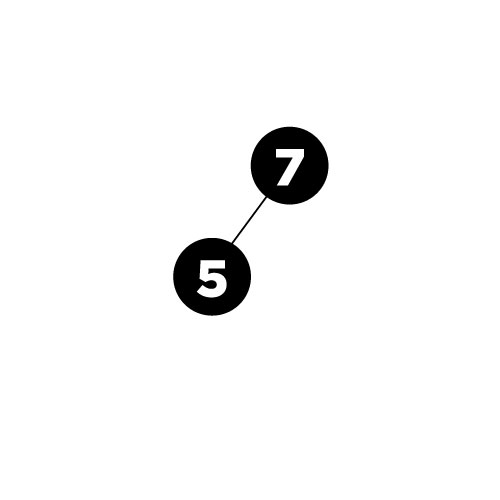
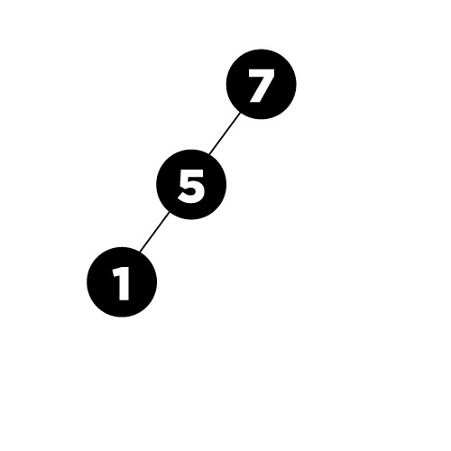
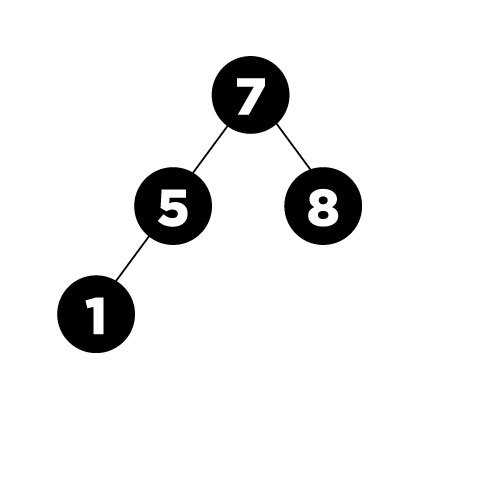
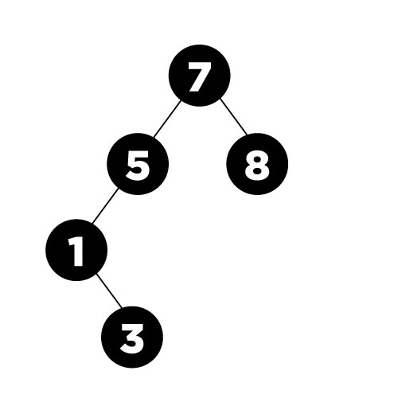
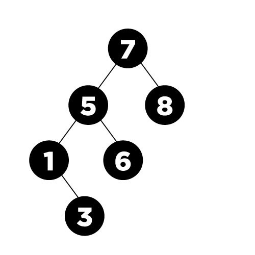
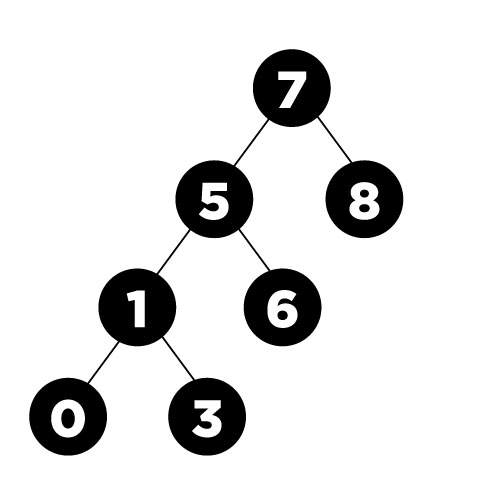
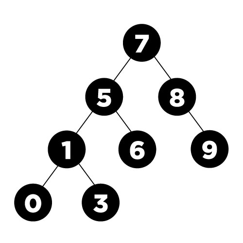
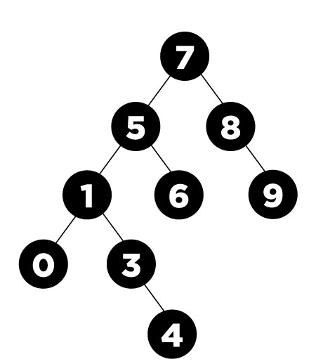
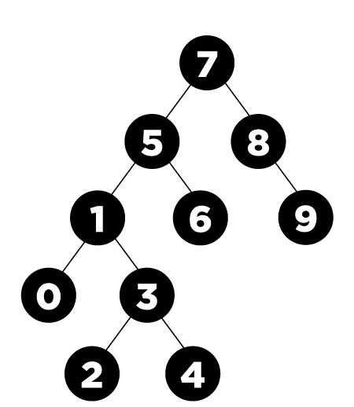

# BinarySearchTree
**1. [7, 5, 1, 8, 3, 6, 0, 9, 4, 2] dizisinin Binary-Search-Tree aşamalarını yazınız.**

**7 ilk sayı olduğu için Root'tur.**

5 7'den küçüktür bu nedenle sola yazılır.

---

1 5'den küçüktür bu nedenle sola yazılır.

---

8 7'den büyüktür bu nedenle sağa yazılır.

---

3 7'den küçüktür sola yazılır ancak 1'den küçük olduğu için 1'in sağına yazılır.

---

6 7'den küçüktür sola yazılır ancak 5'ten büyük olduğu için 5'in sağına yazılır.

---

0 7'den küçüktür sola yazılır ancak 1'den küçük olduğu için 1'in soluna yazılır.

---

9 7'den büyüktür sağa yazılır 8'den  büyük olduğu için 8'in sağına yazılır.

---

4 7'den küçüktür sola yazılır ancak 3'ten büyük olduğu için 3'ün sağına yazılır.

---

2 7'den küçüktür sola yazılır ancak 3'ten küçük olduğu için 3'ün soluna yazılır.

[patika.dev](https://app.patika.dev/paths)